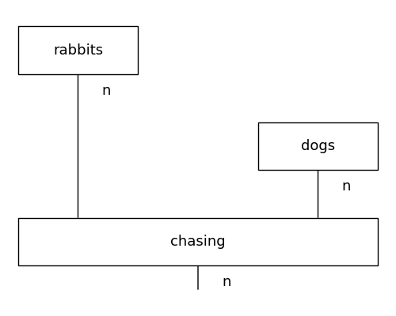

# Using Quantum NLP for Intelligent Understanding of Sentences

In this project, we use the quantum NLP library **Lambeq** to process sentences into quantum circuits, which can then be trained on a quantum computer for syntax-based understanding.

Model recorded **92.86% accuracy** after 200 epochs.


### How it works

1. Sentences are first transformed into string diagrams with a syntax-based model.
2. The string diagram is rewritten and normalized to reduce computational overhead and training time.
3. The abstract string diagram is parametrized, transformed into a concrete quantum circuit (for quantum computers) or tensor network (for classical computers)
4. By sending many sentences into this pipeline, we can train a model off the quantum circuits to perform specific NLP tasks, like classification. 

Each step of the process is visualized through the below diagrams. 




### Installation

1. Install python and pip. 
2. Run the following commands to install required libraries:
   ```
   pip install lambeq 
   pip install ipython  # For data visualization
   pip install pytket-qiskit
   pip install pylatexenc
   pip install pytest  # For running tests
   ```
   
### Usage

- [quantum_user_input.py](app/src/main/quantum_user_input.py)
  - Send a sentence into the quantum pipeline, and view resulting string diagrams and quantum circuits.
- [classical_user_input.py](app/src/main/classical_user_input.py)
  - Send a sentence into the classical pipeline, and see the resulting string diagrams and tensor networks.
- [quantum_training.py](app/src/main/quantum_training.py)
  - Trains a model off quantum circuits, to classify sentences as containing an object-based or subject-based relative clause.

### Limitations

- Right now, the model is limited to single sentences with simple grammar. 

- For very long, complex sentences, a large number of qubits will be required for the quantum circuit representation. This can cause complications depending on the quantum machine's capability to process many qubits any once.

### Acknowledgements
- Research paper: https://arxiv.org/pdf/2110.04236.pdf
- Lambeq documentation: https://cqcl.github.io/lambeq/notebooks.html
